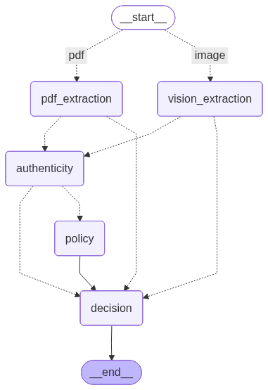
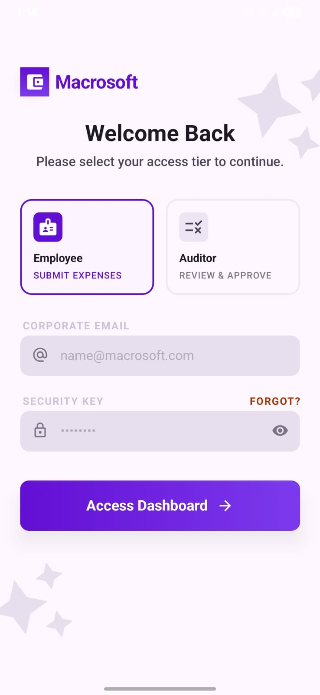
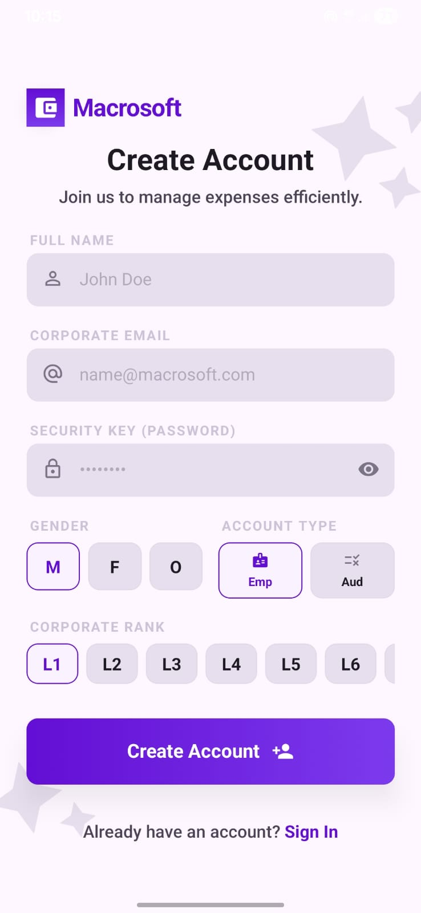
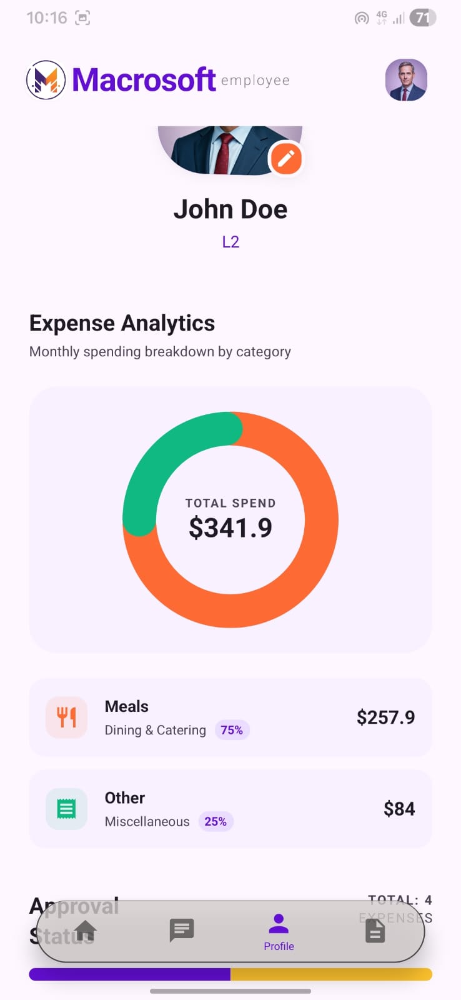
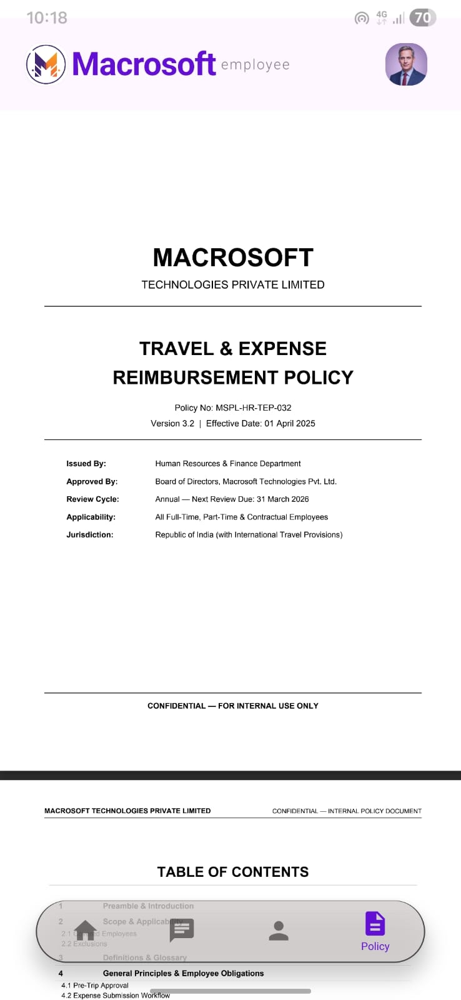
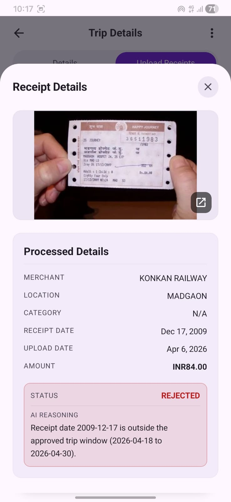
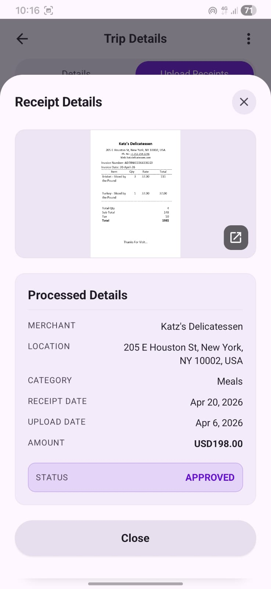
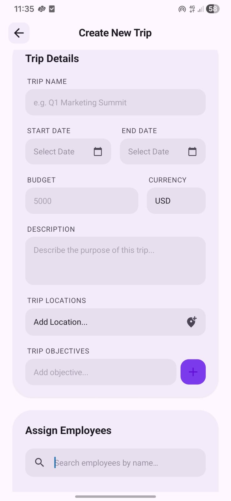

# Macrosoft Expense Tracker

## The Problem
Managing and auditing travel expenses is a tedious and manual process for both employees and accounting teams. Employees often struggle to keep track of complex company spending policies or track their receipts properly, while auditors spend excessive hours manually cross-referencing paper or digital receipts for authenticity, correct amounts, and policy adherence. 

## The Solution
The Macrosoft Expense Tracker is a hybrid mobile application and intelligent backend system that automates the expense reporting and auditing process. Employees can snap photos of their receipts or upload them to the app, which automatically synchronizes with a cloud database. An AI-powered auditor uses an advanced LangGraph agent and vision models to parse the receipts, verify their authenticity, detect potential fraud, and instantly evaluate them against company policies. This allows for near real-time automated approvals or itemized feedback for policy violations, reducing the auditor's workload and enhancing visibility into company spending.

## Features
* **Automated Receipt Parsing:** Uses advanced AI vision models to extract structured data from physical and digital receipts.
* **Policy Compliance Checking:** Validates receipts against company policies using a vector database (RAG) to ensure adherence.
* **Fraud Detection:** Checks for vendor authenticity, location proximity, and transaction date validity.
* **Dual Roles:** Dedicated interfaces for Employees (submitting expenses) and Auditors (reviewing and approving).
* **Interactive AI Assistant:** A chat-based interface to explain policy violations and provide context-aware assistance.
* **Policy Document Viewer:** A feature to view the policy documents in a structured format.
* **Dashboard and Analytics:** A dashboard to view the analytics of the expenses and the policy violations.
* **Trip Management:** A feature to manage the trips and the expenses associated with each trip.

## The Langgraph System 


### 1. Multi-modal Intake & Extraction Node
   - Vision Extraction: Uses Gemini-2.5-Flash to OCR and interpret receipt images (JPEG/PNG).
   - Structured PDF Extraction: Parses digital documents using PyPDFLoader for high-fidelity text extraction.
### 2. Receipt Authenticity Checking Node
   - Merchant Lookup: Verifies if the vendor actually exists in the target trip city using Tavily Search.
   - Currency Check: Validates that the transaction currency matches the geographical region of the trip.
   - Proximity Logic: Uses LLM reasoning to allow for short-form locations (e.g., "NY" for New York).
   - Checks Date window: Validates if the transaction date is within the trip date window.
   - Uses Gemini-3-flash-preview for the above checks.
### 3. Policy Compliance Node
   - RAG-Augmented Analysis: Retrieves relevant policy clauses from a vector database (Chroma) to ensure context-aware decision-making.
   - Flags violations with specific page references for the human auditor.
   - Uses GPT-5.4-nano for the above checks.
### 4. Decision Node
   - Approves or Rejects the receipt based on the policy compliance.
   - Sends the receipt to the human auditor for review if there are any violations and describes the violations.
   - Uses gemini-2.5-flash

## Tech Stack
* **Programming Languages:** Python, TypeScript, JavaScript
* **Frameworks:** React Native (Expo), FastAPI, LangGraph, LangChain, NativeWind (TailwindCSS)
* **Databases:** PostgreSQL (Supabase), Chroma (Vector Database for RAG)
* **APIs or third-party tools:** Google Gemini API, OpenAI API, Tavily API, Supabase Storage

## Setup Instructions

### Backend Setup
1. Open a terminal and navigate to the `backend` directory:
   ```bash
   cd backend
   ```
2. Set up your environment variables by copying the example file:
   ```bash
   cp .env.example .env
   ```
3. Fill in your API keys in the `.env` file (`GEMINI_API_KEY`, `OPENAI_API_KEY`, `TAVILY_API_KEY`).
4. Install the dependencies using `uv`:
   ```bash
   uv sync
   ```
5. Start the backend server:
   ```bash
   uv run uvicorn main:app --reload --host 0.0.0.0 --port 8000
   ```
   The backend API will be available at `http://localhost:8000` and docs at `http://localhost:8000/docs`.

### Frontend Setup
1. Open a new terminal instance and navigate to the `frontend` directory:
   ```bash
   cd frontend
   ```
2. Create a `.env` file in the `frontend` directory and configure the required environment variables. Add the following keys:
   ```bash
   EXPO_PUBLIC_SUPABASE_URL=your_supabase_project_url
   EXPO_PUBLIC_SUPABASE_ANON_KEY=your_supabase_anon_key
   EXPO_PUBLIC_API_URL=http://localhost:8000  # Or your backend's local IP address eg) http://10.168.62.237:8000 (we do this if expo native is running in another phone)
   ```
3. Install the necessary dependencies via npm:
   ```bash
   npm install
   ```
4. Start the Expo development server:
   ```bash
   npm run start
   ```
5. Follow the instructions in the terminal to open the app on an Android emulator, iOS simulator, or a physical device using the Expo Go app.

### Note
If signup failed due to supabase rate limiting or other factors:
- Use the following dummy emails to login:
```
  - johndoe@macrosoft.com: [Employee]
  - janedoe@macrosoft.com: [Auditor]
  - password: 123456
```

* For more details on [Backend](backend/README.md)
* For more details on [Frontend](frontend/README.md)

### Screenshots
<div style="display: flex; flex-wrap: wrap; gap: 10px;">
   
   
   
   
   
</div>
<div style="display: flex; flex-wrap: wrap; gap: 10px; margin-top: 15px;">
   
   
   
   
   
   
</div>

## Advantages
* **Time Savings:** Drastically reduces the time spent on manual data entry and receipt cross-referencing.
* **Enhanced Accuracy:** Minimizes human error in calculating expense amounts and verifying complex compliance rules.
* **Transparency:** Provides clear reasoning and specific policy document references for any rejected or flagged expenses.

## Disadvantages
* **Processing Time:** The processing time can be high because of using free tier services from google gemini
* **Performance** In some cases performance is low because of using comparitevly low end models from openai and gemini
* **Complex Infrastructure:** Requires configuration of multiple API keys, a vector database, and Supabase for local deployment.

## Future Enhancements
* **Dynamic Notification**
* **Advanced Analytics**
* **Multi Receipt Processing**
* **Improving Models and Performance**

